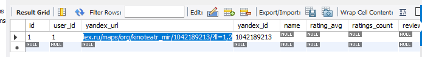

# Интеграция с Яндекс.Картами (сейчас просто базовая раскидано всё)

Приложение из двух экранов: авторизация и страница организации с отзывами/рейтингом, подтянутыми парсингом карточки на Яндекс.Картах.

Репозиторий - монорепа: `backend/` и `frontend/` разделены.

## Как работает парсер:
Сейчас он работает чисто на запросах. (в YandexMapsScraper.php). 
Выбрал следующий подход, так как архитектурно оказалось проще сделать всё на php, один процесс, ничего снаружи не запускается, не нужно никаких лишних слоёв. 
Вполне легко по ресурсам, ибо всё на шустрых запросах, а парсеры на запросах автоматически выигрывают у предложеном варианте с headless-браузером, так как не нужно накатывать Playwright или Selenium, Chromium сам по себе тяжелый, нам не нужно ждать с запросами, когда там браузер отрисует страницу. Просто мы имеем быстрые HTTP - запросы. Также мы имеем меньше причин попасть под rate-limit, headless браузеры оставляют более заметный отпечаток (мы можем конечно использовать для этого так называемый Browser Automation Studio "BAS", но это еще тяжелее и совсем не ложится под задачу, + наверняка затребует прокси + придётся костылить). А HTTP-запросы с реалистичными заголовками чище и тише. Также мы имеем меньше так называемых точек отказа (а почему имеено, можно будет узнать в блоке Неудавшийся вариант.)

Подается один GET запрос на https://yandex.ru/maps/org/<id>/reviews/ и мы получаем HTML из которой дёргаем csrf токен, а у csrf есть приятное свойство - они лежат прям в html разметке и далеко лезть не надо. Название и рейтинг/счётчики дёргаем из блока schema.org itemProp="aggregateRating".
После подаём GET запросы на внутренний API /maps/api/business/fetchReviews?page=1,2,3 с подписью s, которую сами считаем из SignatureGenerator.php. Куки между запросами хранит CookieJar. Между страницами usleep 0.4-0.9 сек. 
Запуск идёт из ParseOrganizationReviews.php — это Job очереди, который вызывает YandexMapsScraper и уже сам сохраняет результат в БД. при ошибках 429 и 403 (так называемый форБидон) откладывает попытку на потом

## Неудавшийся вариант
Изначально я вообще подумал использовать отдельный "сервис" в котором будет Node-процесс на Playwright. С этим можно было бы понасоздавать побольше воркеров и работало бы. Но я такой вариант выбрал сначала потому, что уже часто траил парсеры на Selemium и Playwright и всегда была проблема - загрузка. Также они часто палились анти-батонами. У меня буквально сначала headless-Chromium кликал вкладку "Отзывы", скроллил мышкой а потом доставал данные перехватом сетевых ответов браузера. Laravel вызывал этот скрипт как внешний процесс читал JSON из его вывода. Вот почему вариант на запросах еще лучше, вернёмся к точкам отказа. В варике с headless-Chromium приходилось доставать по-разному в зависимости от сценария, то из перехваченного API-ответа, то из текста DOM после клика на вкладку - было 2 разных пути с багами между ними. Сейчас рейтинг и отзывы стабильно берутся из одних и тех же простых мест. 

## Что реализовано

- Авторизация по логину/паролю через Laravel Sanctum (SPA cookie-auth), сид-пользователь для входа
- Vue-SPA с гардом маршрутов: неавторизованный редиректиися на страницу входа, авторизованный - на итоговую страницу
- Итоговая страница (пока заглушка) с данными вошедшего пользователя и кнопкой выхода
- Миграции и подключение к MySQL
- Модель данных: organizations, reviews, organization_snapshots, parsing_runs (миграции + Eloquent-модели со связями)
- API для сохранения ссылки на карточку организации (POST /api/organization) с валидацией формата ссылки Яндекс.Карт и извлечением yandex_id
- Парсер карточки Яндекс.Карт на чистых HTTP-запросах (YandexMapsScraper) — без headless-браузера, с извлечением рейтинга/счётчиков/названия и постраничным сбором отзывов
- ParseOrganizationReviews - Job очереди, который запускается сразу после сохранения ссылки, парсит организацию и сохраняет результат
- Обработка ошибок парсинга с ретраями
- 17 автотестов
- Страница настроек (форма вставки ссылки, показ ошибок валидации)
- Итоговая страница с реальными данными: рейтинг, счётчики, таблица отзывов с пагинацией по 50
- Автообновление статуса (poll), пока идёт парсинг
- Фронтенд на FSD + TypeScript

## Что не реализовано
Нормальный дизайн, думаю, лучше показать норм архитектуру. На красивый CSS уже времени не хватило. 

## Ответы по дополнительным требованиям (1-5)

1. Анти-бан - реализована пауза между запросами, реалистичные заголовки. Не сделана ротация проксей, не делал этого, так как посчитал не нужным для тестового, вот как я бы сделал это при необходимости: 
    - Аренда прокси (proxy-bunker или ake.net) эти два сервиса дают возможность использовать прокси по ссылке, можно было бы сделать ротацию проксей на каждый запрос и сделать отдельный воркер под ошибки от проксей, автоматическую смену и автоматическое обновление проксей. Единственное - стоит подобрать прокси под яндекс, я не проверял, ест ли он socks5 или https, или он ест сразу их. Также надо подобрать ротацию под прокси или использовать без ротации (это делается в целом всё в ЛК прокси провайдера). 
2. Ротация User-Agent - не сделана. Сейчас используется один захардкоженный UA всегда. Если делать смену UA, то можно собрать один пул реалистичных строк UA и выбор случайного UA на каждую сессию скрапинга. 

3. Бэкофф на уровне очереди - при получении 429/403 вся задача откладывается с нарастающей задержкой 1 -> 5 -> 15 минут, а не просто падает. Это отдельная защита поверх паузы между страницами. 

4. Обработка "нас забанили" как отдельного случая - сделана. 

### Тестирование API вручную

В backend/requests.http лежат готовые запросы для REST Client.
1: Открываете requests.http
2: Выполняете запрос sanctum/csrf-cookie и из ответа дёргается Set-Cookie: XSRF-TOKEN=
3: копируете значение, декодируете %3D в =, проще всего через decodeURIComponent в консоли браузера
4: выполнение запросов по порядку
Результат для SELECT * FROM laravel_vue_test.organizations;: 


## Как запустить локально

Требования: PHP 8.4+ и Composer (локально у меня [Laravel Herd](https://herd.laravel.com/windows)), Node.js 22+, локальный MySQL.

### Backend запуск

```bash
cd backend
composer install
php artisan migrate:fresh --seed
php artisan serve
```

Поднимется на `http://localhost:8000` (ну есди порт не занят).

### Frontend

```bash
cd frontend
npm install
npm run dev
```

Поднимется на `http://localhost:5173` — открывать в браузере нужно именно `localhost`, не `127.0.0.1` (иначе не совпадёт домен cookie сессии/CSRF и получатся какашки попки).

### Вход

- Email: `test@example.com`
- Пароль: `password`

### Переменные окружения

- `backend/.env`: `DB_*` — подключение к MySQL, `SANCTUM_STATEFUL_DOMAINS` и `FRONTEND_URL` — адрес фронтенда для CORS/cookie
- `frontend/.env`: `VITE_BACKEND_URL` — адрес бэкенда

Если меняются порты/домены — обновить оба файла синхронно.

